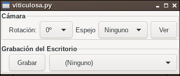

# viticulosa

Desktop recording and shows webcam in window.

Aplicación para grabar el escritorio en Linux y mostrar la webcam en una ventana. Está escrito en python3.

# Construcción

Se deben instalar las dependencias python3, Gtk3, gstreamer y ffmpeg:

En Ubuntu con la siguiente línea debería ser suficiente:

    sudo apt-get install libgstreamer1.0-0 gstreamer1.0-plugins-base gstreamer1.0-plugins-good gstreamer1.0-plugins-bad gstreamer1.0-plugins-ugly gstreamer1.0-libav gstreamer1.0-doc gstreamer1.0-tools gstreamer1.0-x gstreamer1.0-alsa gstreamer1.0-gl gstreamer1.0-gtk3 gstreamer1.0-qt5 gstreamer1.0-pulseaudio ffmpeg python3-requests

Una vez instaladas las dependencias, se construye la aplicación:

    make

Ya se tendrá un ejecutable llamado "viticulosa.py". Se puede copiar a su ubicación definitiva.

Para ejecutarlo:

    ./vitivulosa.py

